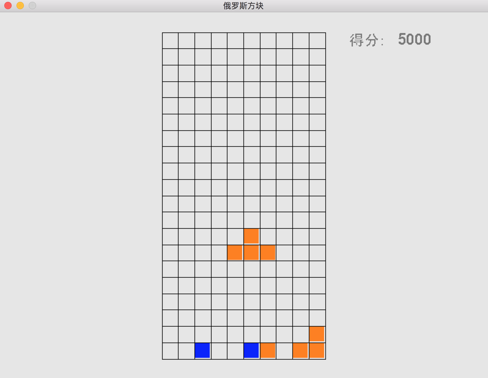

##程序入口：main.py

#目前尚在开发中～

##更新日志：
#【7.25】正式登陆github。

##操作说明：
	#1.按S开始游戏；
	#2.按P暂停，再按一次恢复；
	#3.按空格快速下落；
	
##计分规则：
	#1.一次性消除一行100分；
	#2.一次性消除两行200分；
	#3.一次性消除三行400分；
	#4.一次性消除四行800分。

##存在问题：
	#1.游戏暂时不能结束；
	#2.下落时碰撞机制未编写。
	
##开发环境：Python3.6
##依赖：pygame
##截图demo

